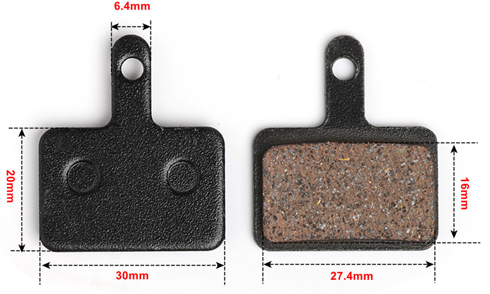
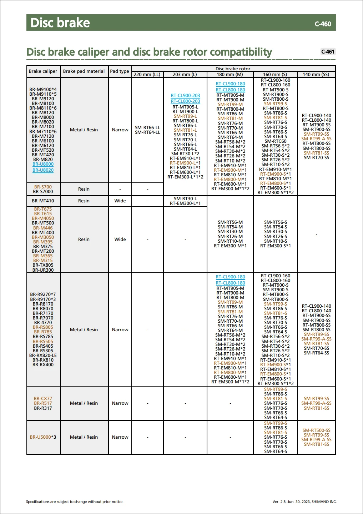
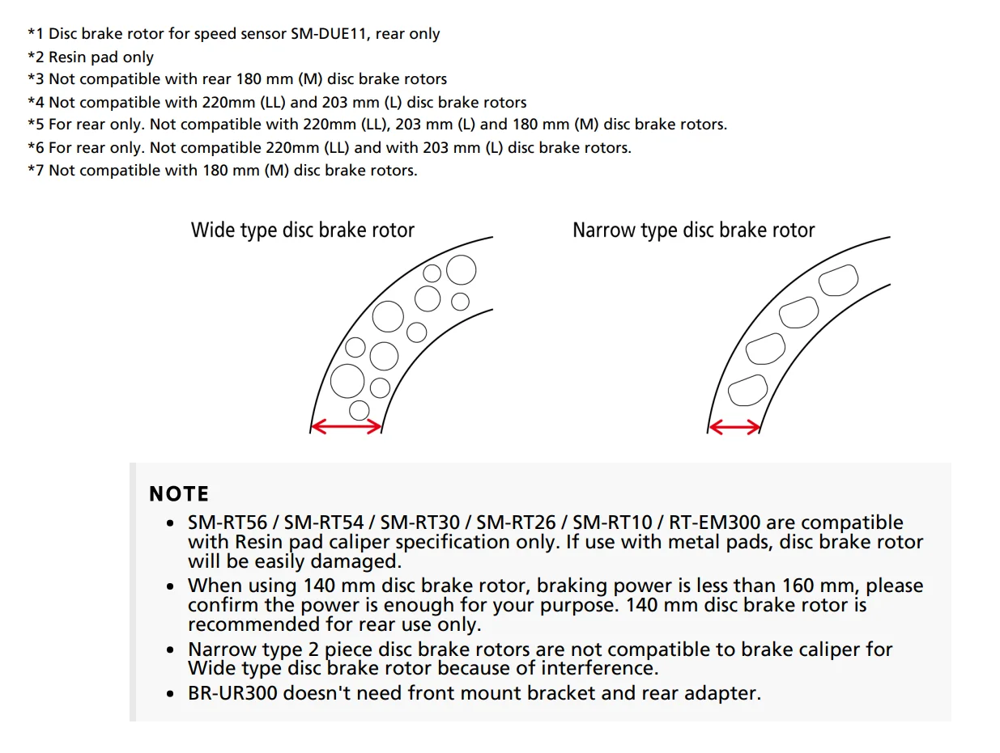

:::info
Originally posted at Reddit 2023-08-20: <https://www.reddit.com/r/bicycling/comments/15wca29>
:::

## Background

Is a 160mm disc brake rotor a 160mm disc brake rotor? No, it's not. Disc brakes have different sizes on the width between the brake pads (= disc brake rotor thickness) and brake pad braking surface height (= disc brake rotor braking surface height) too.

Why is it so hard to find this measurement though? I first came aware of this when I bought a Shimano  SM-RT66 rotor for my commuter bike with Shimano BR-M355 calipers. I noticed that the brake surface height on the new rotors seemed a bit narrow vs. the height of the braking surface of my disc brake pads (Shimano B05S).

I then became aware of the Shimano concept of "wide" and "narrow" disc brakes and rotors.

* <https://productinfo.shimano.com/en#/com>
  * As website: <https://productinfo.shimano.com/en/compatibility/C-461>
  * As PDF: <https://productinfo.shimano.com/pdfs/product/Compatibility_en.pdf>

^ Shimano compatibility as PDF, page 38.

^ Shimano compatibility as PDF, page 39.

Shimano is kind enough (/s) to not say anything about what measurements "wide" and "narrow" is. But from researching the measurements of some of the brake pads mentioned, I found out that "wide" like the B05S pad is 16mm, and "narrow" like the G05S-RX pad is 14.4mm.

## Comparison table

I then started the jurney to find this information myself. Then realised NO ONE lists this info on their web pages. I've reached out to Bracko, Hope (answered me fast, said they'd add info), Jagwire, KCNC, TRP and XLC, tro try to complete this table.

| Brand   | Variation | Brake surface height | Found out how                                                                                                                |
| :------ | :-------- | :------------------- | :--------------------------------------------------------------------------------------------------------------------------- |
| Brakco  |           | ?                    |                                                                                                                              |
| Clarks  |           | ?                    |                                                                                                                              |
| Hope    |           | 15.0mm               | Hope answered my email.                                                                                                      |
| Jagwire |           | ?                    |                                                                                                                              |
| KCNC    |           | ?                    |                                                                                                                              |
| Shimano | Narrow    | 14.4mm               | Measured G05S-RX brake pads.                                                                                                 |
| Shimano | Wide      | 16.0mm               | Measured B05S brake pads.                                                                                                    |
| Sram    |           | 15.5mm?              | Sram Paceline has this according to [r2-bike.com](https://r2-bike.com/SRAM-Brake-Disc-Paceline-Rounded-Edges-160-mm-6-Bolt). |
| Tektro  |           | ?                    |                                                                                                                              |
| TRP     |           | ?                    |                                                                                                                              |
| XLC     |           | ?                    |                                                                                                                              |

## Ending words

Thoughts? I find it warrying that it's so hard to find required information to make a good decision when replacing rotors for a disc brake. I bet there are many out there with mismatched rotors and brakes not even knowing. I bet many bike shops don't know this either.

If you know the measurements of more disc brake rotor manufacturers, please share it by making a [GitHub issue](https://github.com/o-l-a-v/o-l-a-v.github.io/issues/new/choose) so I can make the table more complete. 🙂
