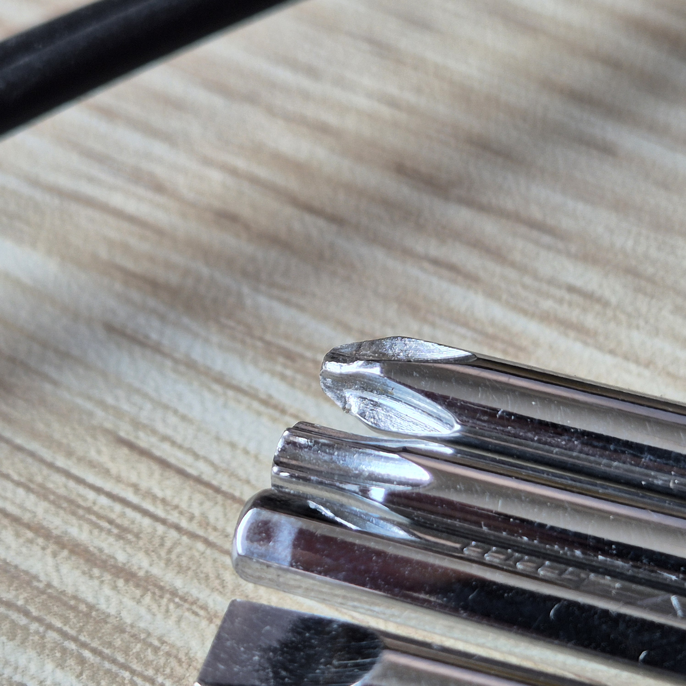

## Review

### Summary

Avoid. It's cheap, flimsy, and the metal is too soft.

### Pros

* Cheap.
* Good tool selection, most common sizes and tools.

### Cons

* Cheap.
* The body made of "glassfibre reinforced resin" is just soft, flimsy plastic, which makes the whole tool flex a lot.
* The tools made of "robust and durable steel, which has also been coated with a protective layer of chrome" is too soft, the philips PH2 screwdriver got twisted early on.

## Metadata

* Product number / P/N / MPN: PRTL0122
* EAN / GTIN: 8717009422208
* Product page: <https://www.pro-bikegear.com/no/tools-maintenance/tools/minitool-10>
